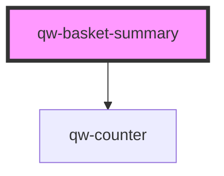

# qw-basket-summary

<!-- Auto Generated Below -->

## Events

| Event                       | Description | Type                                               |
| --------------------------- | ----------- | -------------------------------------------------- |
| `qwBasketChange`            |             | `CustomEvent<BasketModel>`                         |
| `removeInsuranceAcceptance` |             | `CustomEvent<{ insurance: any; amount: number; }>` |

## Dependencies

### Depends on

- [qw-counter](../shared/qw-counter)

### Graph

----------------------------------------------

*Built with [StencilJS](https://stenciljs.com/)*
