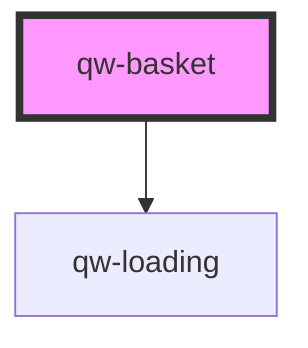

# qw-basket

<!-- Auto Generated Below -->

## Properties

| Property                  | Attribute                     | Description | Type      | Default |
| ------------------------- | ----------------------------- | ----------- | --------- | ------- |
| `qwBasketShowEmptyButton` | `qw-basket-show-empty-button` |             | `boolean` | `false` |

## Dependencies

### Depends on

- [qw-loading](../shared/qw-loading)

### Graph

----------------------------------------------

*Built with [StencilJS](https://stenciljs.com/)*
