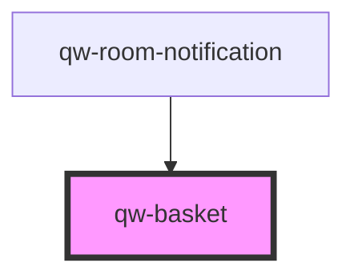

# qw-basket

<!-- Auto Generated Below -->

## Properties

| Property                    | Attribute                        | Description | Type      | Default |
| --------------------------- | -------------------------------- | ----------- | --------- | ------- |
| `qwBasketShowBookNowButton` | `qw-basket-show-book-now-button` |             | `boolean` | `false` |
| `qwBasketShowEmptyButton`   | `qw-basket-show-empty-button`    |             | `boolean` | `false` |
| `qwBasketShowOnSiteTaxes`   | `qw-basket-show-on-site-taxes`   |             | `boolean` | `false` |
| `qwBasketShowPriceIfEmpty`  | `qw-basket-show-price-if-empty`  |             | `boolean` | `false` |
| `qwBasketShowTaxes`         | `qw-basket-show-taxes`           |             | `boolean` | `false` |

## Events

| Event                            | Description | Type                   |
| -------------------------------- | ----------- | ---------------------- |
| `qwBasketBookNow`                |             | `CustomEvent<void>`    |
| `qwBasketClickPrice`             |             | `CustomEvent<void>`    |
| `qwBasketIsAccommodationSatisfy` |             | `CustomEvent<boolean>` |

## Dependencies

### Used by

 - [qw-room-notification](../qw-room-notification)

### Graph

----------------------------------------------

*Built with [StencilJS](https://stenciljs.com/)*
