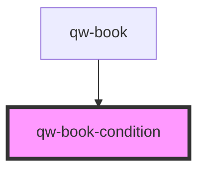

# qw-book-condition

<!-- Auto Generated Below -->

## Properties

| Property                   | Attribute                     | Description | Type      | Default |
| -------------------------- | ----------------------------- | ----------- | --------- | ------- |
| `qwBookConditionStateless` | `qw-book-condition-stateless` |             | `boolean` | `false` |

## Dependencies

### Used by

 - [qw-book](../qw-book)

### Graph

----------------------------------------------

*Built with [StencilJS](https://stenciljs.com/)*
