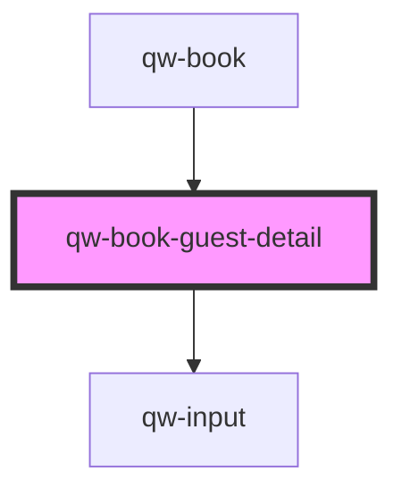

# qw-book-guest-detail

<!-- Auto Generated Below -->

## Properties

| Property                        | Attribute                 | Description | Type                     | Default     |
| ------------------------------- | ------------------------- | ----------- | ------------------------ | ----------- |
| `qwBookFormShowError`           | `qw-book-form-show-error` |             | `boolean`                | `undefined` |
| `qwBookGuestDetailTitleOptions` | --                        |             | `RoomMetadata<string>[]` | `[]`        |

## Events

| Event                         | Description | Type                           |
| ----------------------------- | ----------- | ------------------------------ |
| `qwBookGuestDetailChangeForm` |             | `CustomEvent<QuoteCreateBody>` |

## Dependencies

### Used by

 - [qw-book](..)

### Depends on

- [qw-input](../../shared/qw-input)

### Graph

----------------------------------------------

*Built with [StencilJS](https://stenciljs.com/)*
