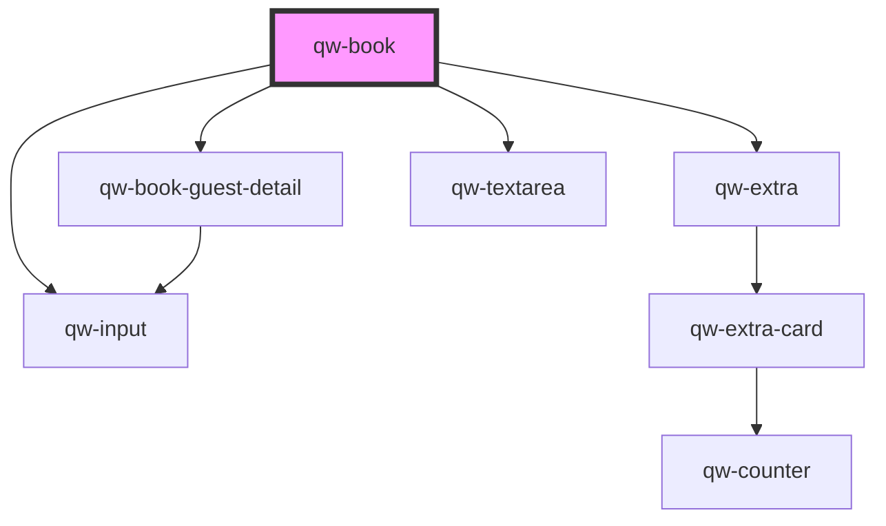

# qw-book

<!-- Auto Generated Below -->

## Properties

| Property                  | Attribute                     | Description | Type     | Default     |
| ------------------------- | ----------------------------- | ----------- | -------- | ----------- |
| `qwBookErrorQuoteMessage` | `qw-book-error-quote-message` |             | `string` | `undefined` |

## Dependencies

### Depends on

- [qw-book-guest-detail](qw-book-guest-detail)
- [qw-extra](../qw-extra)
- [qw-textarea](../shared/qw-textarea)
- [qw-input](../shared/qw-input)

### Graph

----------------------------------------------

*Built with [StencilJS](https://stenciljs.com/)*
