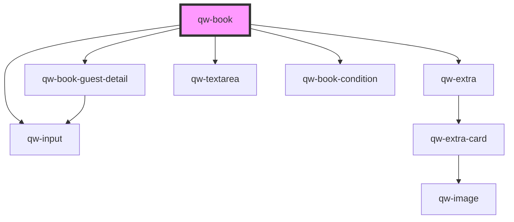

# qw-book

<!-- Auto Generated Below -->

## Events

| Event                       | Description | Type                                               |
| --------------------------- | ----------- | -------------------------------------------------- |
| `changeInsuranceAcceptance` |             | `CustomEvent<{ insurance: any; amount: number; }>` |
| `qwBookIsLoaded`            |             | `CustomEvent<void>`                                |

## Dependencies

### Depends on

- [qw-book-guest-detail](qw-book-guest-detail)
- [qw-extra](../qw-extra)
- [qw-textarea](../shared/qw-textarea)
- [qw-book-condition](../qw-book-condition)
- [qw-input](../shared/qw-input)

### Graph

----------------------------------------------

*Built with [StencilJS](https://stenciljs.com/)*
