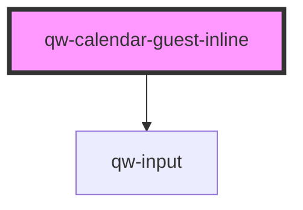

# qw-calendar-guest-inline

<!-- Auto Generated Below -->

## Properties

| Property                               | Attribute                                    | Description | Type      | Default |
| -------------------------------------- | -------------------------------------------- | ----------- | --------- | ------- |
| `qwCalendarGuestInlineShowCheckButton` | `qw-calendar-guest-inline-show-check-button` |             | `boolean` | `true`  |
| `qwCalendarGuestInlineShowInputs`      | `qw-calendar-guest-inline-show-inputs`       |             | `boolean` | `true`  |

## Events

| Event                                    | Description | Type                                                                                       |
| ---------------------------------------- | ----------- | ------------------------------------------------------------------------------------------ |
| `qwCalendarGuestInlineCheckAvailability` |             | `CustomEvent<void>`                                                                        |
| `qwCalendarGuestInlineClickInput`        |             | `CustomEvent<QwCalendarGuestInlineInputType.Date \| QwCalendarGuestInlineInputType.Guest>` |

## Dependencies

### Depends on

- [qw-input](../shared/qw-input)

### Graph

----------------------------------------------

*Built with [StencilJS](https://stenciljs.com/)*
