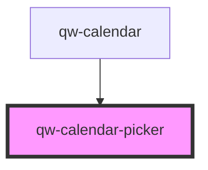

# qw-calendar-picker

<!-- Auto Generated Below -->

## Properties

| Property                         | Attribute                             | Description | Type                | Default       |
| -------------------------------- | ------------------------------------- | ----------- | ------------------- | ------------- |
| `qwCalendarPickerConfig`         | `qw-calendar-picker-config`           |             | `any`               | `undefined`   |
| `qwCalendarPickerDesktopLimit`   | `qw-calendar-picker-desktop-limit`    |             | `number`            | `undefined`   |
| `qwCalendarPickerDisabled`       | `qw-calendar-picker-disabled`         |             | `boolean`           | `undefined`   |
| `qwCalendarPickerId`             | `qw-calendar-picker-id`               |             | `string`            | `CALENDAR_ID` |
| `qwCalendarPickerLocale`         | `qw-calendar-picker-locale`           |             | `string`            | `undefined`   |
| `qwCalendarPickerNumberOfMonths` | `qw-calendar-picker-number-of-months` |             | `number`            | `undefined`   |
| `qwCalendarPickerResponsive`     | `qw-calendar-picker-responsive`       |             | `boolean`           | `undefined`   |
| `qwCalendarPickerStayPeriod`     | --                                    |             | `SessionStayPeriod` | `undefined`   |

## Events

| Event                         | Description | Type                             |
| ----------------------------- | ----------- | -------------------------------- |
| `qwCalendarPickerChangeDates` |             | `CustomEvent<SessionStayPeriod>` |

## Dependencies

### Used by

 - [qw-calendar](..)

### Graph

----------------------------------------------

*Built with [StencilJS](https://stenciljs.com/)*
