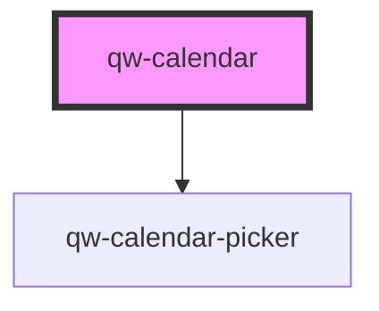

# qw-calendar

<!-- Auto Generated Below -->

## Properties

| Property                   | Attribute                      | Description | Type     | Default |
| -------------------------- | ------------------------------ | ----------- | -------- | ------- |
| `qwCalendarNumberOfMonths` | `qw-calendar-number-of-months` |             | `number` | `1`     |

## Dependencies

### Depends on

- [qw-calendar-picker](qw-calendar-picker)

### Graph

----------------------------------------------

*Built with [StencilJS](https://stenciljs.com/)*
