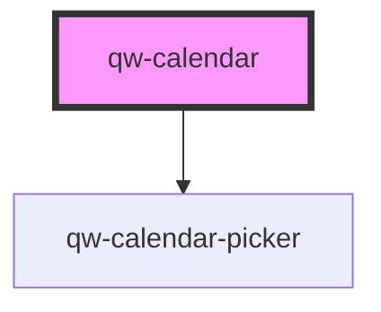

# qw-calendar

<!-- Auto Generated Below -->

## Properties

| Property                   | Attribute                      | Description | Type      | Default |
| -------------------------- | ------------------------------ | ----------- | --------- | ------- |
| `qwCalendarDesktopLimit`   | `qw-calendar-desktop-limit`    |             | `number`  | `600`   |
| `qwCalendarNumberOfMonths` | `qw-calendar-number-of-months` |             | `number`  | `1`     |
| `qwCalendarResponsive`     | `qw-calendar-responsive`       |             | `boolean` | `true`  |
| `qwCalendarSyncOnChange`   | `qw-calendar-sync-on-change`   |             | `boolean` | `true`  |

## Events

| Event                     | Description | Type                             |
| ------------------------- | ----------- | -------------------------------- |
| `qwBasketWillBeReset`     |             | `CustomEvent<void>`              |
| `qwCalendarChange`        |             | `CustomEvent<SessionStayPeriod>` |
| `qwCalendarChangeSuccess` |             | `CustomEvent<void>`              |

## Dependencies

### Depends on

- [qw-calendar-picker](qw-calendar-picker)

### Graph

----------------------------------------------

*Built with [StencilJS](https://stenciljs.com/)*
