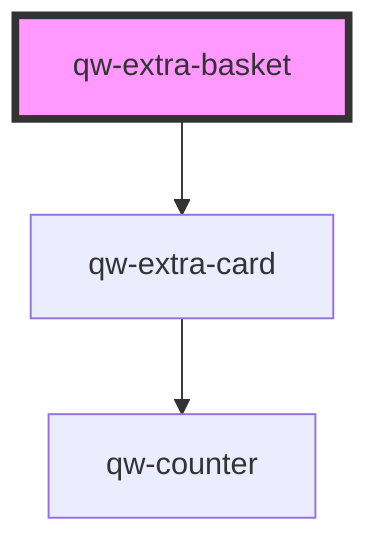

# qw-extra-basket

<!-- Auto Generated Below -->

## Properties

| Property                | Attribute                   | Description | Type     | Default     |
| ----------------------- | --------------------------- | ----------- | -------- | ----------- |
| `qwExtraNoExtraMessage` | `qw-extra-no-extra-message` |             | `string` | `undefined` |

## Dependencies

### Depends on

- [qw-extra-card](../qw-extra/qw-extra-card)

### Graph

----------------------------------------------

*Built with [StencilJS](https://stenciljs.com/)*
