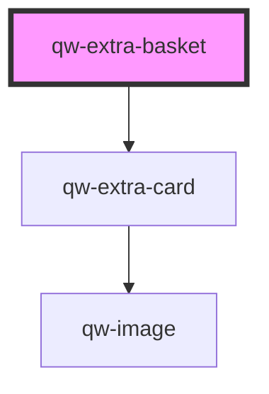

# qw-extra-basket

<!-- Auto Generated Below -->

## Properties

| Property                | Attribute                   | Description | Type                                                 | Default                    |
| ----------------------- | --------------------------- | ----------- | ---------------------------------------------------- | -------------------------- |
| `qwExtraBasketHasImage` | `qw-extra-basket-has-image` |             | `boolean`                                            | `true`                     |
| `qwExtraBasketType`     | `qw-extra-basket-type`      |             | `QwRoomBasketType.Basic \| QwRoomBasketType.Classic` | `QwRoomBasketType.Classic` |

## Dependencies

### Depends on

- [qw-extra-card](../qw-extra/qw-extra-card)

### Graph

----------------------------------------------

*Built with [StencilJS](https://stenciljs.com/)*
