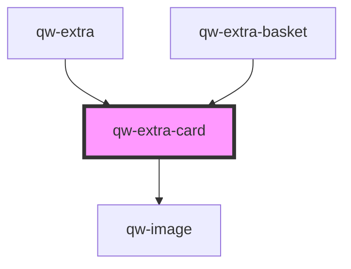

# qw-extra-card

<!-- Auto Generated Below -->

## Properties

| Property                           | Attribute                               | Description | Type              | Default     |
| ---------------------------------- | --------------------------------------- | ----------- | ----------------- | ----------- |
| `qwExtraCardAvailability`          | `qw-extra-card-availability`            |             | `number`          | `undefined` |
| `qwExtraCardCanAddMoreExtra`       | `qw-extra-card-can-add-more-extra`      |             | `boolean`         | `undefined` |
| `qwExtraCardCounting`              | --                                      |             | `QwExtraCounting` | `undefined` |
| `qwExtraCardCover`                 | `qw-extra-card-cover`                   |             | `string`          | `undefined` |
| `qwExtraCardId`                    | `qw-extra-card-id`                      |             | `number`          | `undefined` |
| `qwExtraCardName`                  | `qw-extra-card-name`                    |             | `string`          | `undefined` |
| `qwExtraCardQuantityOptions`       | --                                      |             | `any[]`           | `undefined` |
| `qwExtraCardSelectedQuantityValue` | `qw-extra-card-selected-quantity-value` |             | `number`          | `0`         |
| `qwExtraCardShowCounter`           | `qw-extra-card-show-counter`            |             | `boolean`         | `undefined` |
| `qwExtraCardSummary`               | `qw-extra-card-summary`                 |             | `string`          | `undefined` |
| `qwExtraCardType`                  | `qw-extra-card-type`                    |             | `string`          | `undefined` |
| `qwExtraCardUnitPrice`             | `qw-extra-card-unit-price`              |             | `string`          | `undefined` |
| `qwExtraCardUnitQuantity`          | `qw-extra-card-unit-quantity`           |             | `number`          | `undefined` |

## Events

| Event                    | Description | Type                          |
| ------------------------ | ----------- | ----------------------------- |
| `qwExtraCounterChanged`  |             | `CustomEvent<QwExtraEmitter>` |
| `qwQuantityExtraChanged` |             | `CustomEvent<QwExtraEmitter>` |
| `qwSingleExtraChanged`   |             | `CustomEvent<QwExtraEmitter>` |

## Dependencies

### Used by

 - [qw-extra](..)
 - [qw-extra-basket](../../qw-extra-basket)

### Depends on

- [qw-image](../../shared/qw-image)

### Graph

----------------------------------------------

*Built with [StencilJS](https://stenciljs.com/)*
