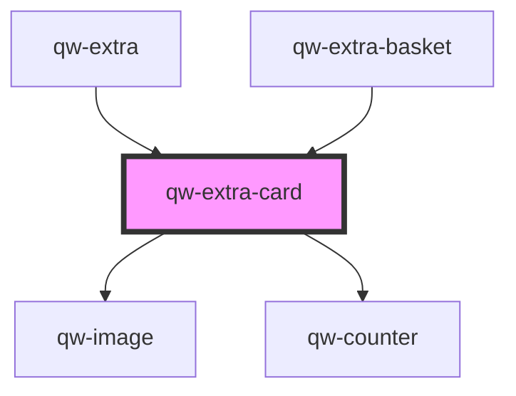

# qw-extra-card

<!-- Auto Generated Below -->

## Properties

| Property                      | Attribute                         | Description | Type     | Default     |
| ----------------------------- | --------------------------------- | ----------- | -------- | ----------- |
| `qwExtraCardAvailability`     | `qw-extra-card-availability`      |             | `number` | `undefined` |
| `qwExtraCardCover`            | `qw-extra-card-cover`             |             | `string` | `undefined` |
| `qwExtraCardId`               | `qw-extra-card-id`                |             | `number` | `undefined` |
| `qwExtraCardName`             | `qw-extra-card-name`              |             | `string` | `undefined` |
| `qwExtraCardSelectedQuantity` | `qw-extra-card-selected-quantity` |             | `number` | `undefined` |
| `qwExtraCardSummary`          | `qw-extra-card-summary`           |             | `string` | `undefined` |
| `qwExtraCardUnitPrice`        | `qw-extra-card-unit-price`        |             | `string` | `undefined` |

## Events

| Event                   | Description | Type                          |
| ----------------------- | ----------- | ----------------------------- |
| `qwExtraCounterChanged` |             | `CustomEvent<QwExtraEmitter>` |

## Dependencies

### Used by

 - [qw-extra](..)
 - [qw-extra-basket](../../qw-extra-basket)

### Depends on

- [qw-image](../../shared/qw-image)
- [qw-counter](../../shared/qw-counter)

### Graph

----------------------------------------------

*Built with [StencilJS](https://stenciljs.com/)*
