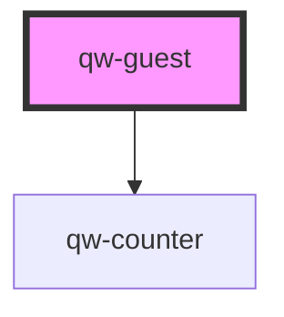

# qw-guest

<!-- Auto Generated Below -->

## Properties

| Property              | Attribute                 | Description | Type      | Default     |
| --------------------- | ------------------------- | ----------- | --------- | ----------- |
| `qwGuestCenter`       | `qw-guest-center`         |             | `boolean` | `undefined` |
| `qwGuestSyncOnChange` | `qw-guest-sync-on-change` |             | `boolean` | `true`      |

## Events

| Event           | Description | Type                         |
| --------------- | ----------- | ---------------------------- |
| `qwGuestChange` |             | `CustomEvent<SessionGuests>` |

## Dependencies

### Depends on

- [qw-counter](../shared/qw-counter)

### Graph

----------------------------------------------

*Built with [StencilJS](https://stenciljs.com/)*
