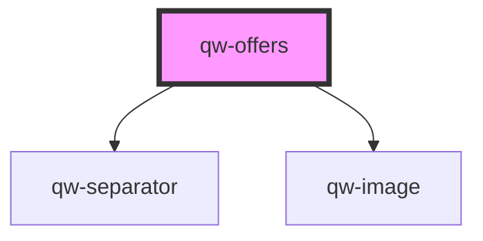

# qw-offers

<!-- Auto Generated Below -->

## Properties

| Property                             | Attribute                                | Description | Type                                                                  | Default                             |
| ------------------------------------ | ---------------------------------------- | ----------- | --------------------------------------------------------------------- | ----------------------------------- |
| `qwOffersImageTransformationOptions` | `qw-offers-image-transformation-options` |             | `string`                                                              | `undefined`                         |
| `qwOffersMax`                        | `qw-offers-max`                          |             | `number`                                                              | `undefined`                         |
| `qwOffersOrder`                      | `qw-offers-order`                        |             | `QwOffersOrderType.OrderByPrice \| QwOffersOrderType.OrderByRoomType` | `QwOffersOrderType.OrderByRoomType` |
| `qwOffersType`                       | `qw-offers-type`                         |             | `QwRoomListType.Card \| QwRoomListType.Grid \| QwRoomListType.Inline` | `QwRoomListType.Grid`               |

## Events

| Event                | Description | Type                               |
| -------------------- | ----------- | ---------------------------------- |
| `qwOffersOfferClick` |             | `CustomEvent<QwOfferClickEmitter>` |
| `qwOffersOnLoad`     |             | `CustomEvent<void>`                |

## Dependencies

### Depends on

- [qw-separator](../shared/qw-separator)
- [qw-image](../shared/qw-image)

### Graph

----------------------------------------------

*Built with [StencilJS](https://stenciljs.com/)*
