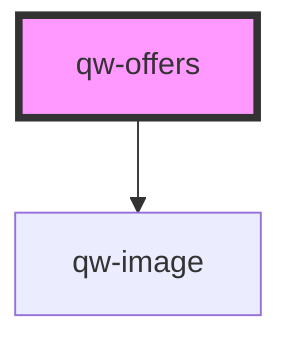

# qw-offers

<!-- Auto Generated Below -->

## Properties

| Property       | Attribute        | Description | Type                                                                  | Default               |
| -------------- | ---------------- | ----------- | --------------------------------------------------------------------- | --------------------- |
| `qwOffersMax`  | `qw-offers-max`  |             | `number`                                                              | `undefined`           |
| `qwOffersType` | `qw-offers-type` |             | `QwRoomListType.Card \| QwRoomListType.Grid \| QwRoomListType.Inline` | `QwRoomListType.Grid` |

## Events

| Event                | Description | Type                               |
| -------------------- | ----------- | ---------------------------------- |
| `qwOffersOfferClick` |             | `CustomEvent<QwOfferClickEmitter>` |

## Dependencies

### Depends on

- [qw-image](../shared/qw-image)

### Graph

----------------------------------------------

*Built with [StencilJS](https://stenciljs.com/)*
