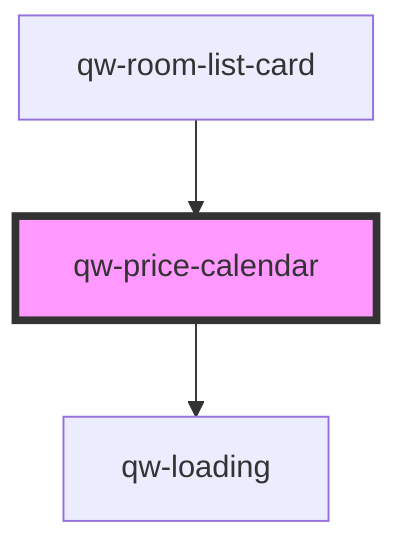

# qw-price-calendar

<!-- Auto Generated Below -->

## Properties

| Property              | Attribute  | Description | Type                   | Default        |
| --------------------- | ---------- | ----------- | ---------------------- | -------------- |
| `context`             | --         |             | `PriceCalendarContext` | `undefined`    |
| `language`            | `language` |             | `string`               | `undefined`    |
| `rangeDate`           | --         |             | `Date[]`               | `[new Date()]` |
| `rangeDateSession`    | --         |             | `Date[]`               | `[new Date()]` |
| `roomId` _(required)_ | `room-id`  |             | `number`               | `undefined`    |

## Events

| Event                        | Description | Type                             |
| ---------------------------- | ----------- | -------------------------------- |
| `qwPriceCalendarChangeDates` |             | `CustomEvent<"left" \| "right">` |

## Dependencies

### Used by

 - [qw-room-list-card](../qw-room-list/qw-room-list-card)

### Depends on

- [qw-loading](../shared/qw-loading)

### Graph

----------------------------------------------

*Built with [StencilJS](https://stenciljs.com/)*
