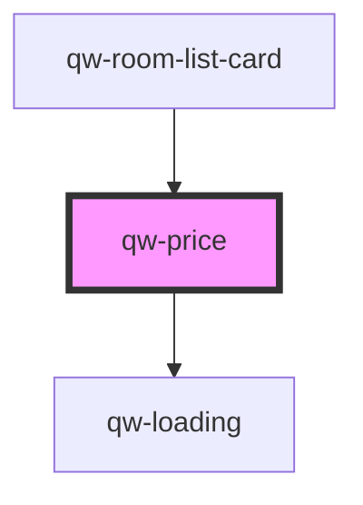

# qw-price

<!-- Auto Generated Below -->

## Properties

| Property              | Attribute                | Description | Type     | Default     |
| --------------------- | ------------------------ | ----------- | -------- | ----------- |
| `qwPriceCaption`      | `qw-price-caption`       |             | `string` | `undefined` |
| `qwPriceCrossedPrice` | `qw-price-crossed-price` |             | `string` | `undefined` |
| `qwPriceMainPrice`    | `qw-price-main-price`    |             | `string` | `undefined` |

## Dependencies

### Used by

 - [qw-room-list-card](../qw-room-list/qw-room-list-card)

### Depends on

- [qw-loading](../shared/qw-loading)

### Graph

----------------------------------------------

*Built with [StencilJS](https://stenciljs.com/)*
