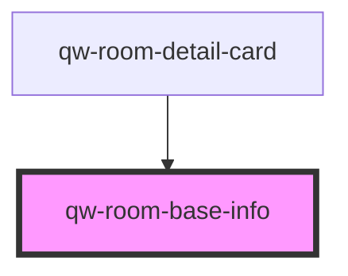

# qw-room-base-info

<!-- Auto Generated Below -->

## Properties

| Property                       | Attribute                            | Description | Type      | Default     |
| ------------------------------ | ------------------------------------ | ----------- | --------- | ----------- |
| `qwRoomBaseInfoForceRoomsCall` | `qw-room-base-info-force-rooms-call` |             | `boolean` | `false`     |
| `qwRoomBaseInfoRoomId`         | `qw-room-base-info-room-id`          |             | `string`  | `undefined` |

## Dependencies

### Used by

 - [qw-room-detail-card](../qw-room-detail/qw-room-detail-card)

### Graph

----------------------------------------------

*Built with [StencilJS](https://stenciljs.com/)*
