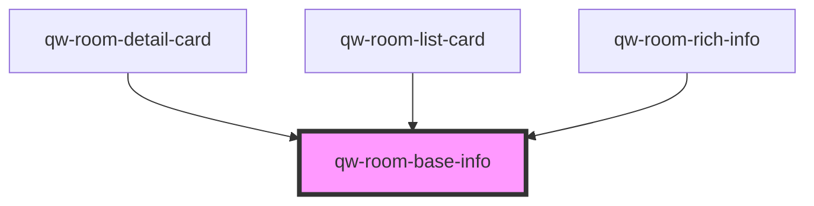

# qw-room-base-info

<!-- Auto Generated Below -->

## Properties

| Property                       | Attribute                            | Description | Type                                                           | Default                        |
| ------------------------------ | ------------------------------------ | ----------- | -------------------------------------------------------------- | ------------------------------ |
| `qwRoomBaseInfoForceRoomsCall` | `qw-room-base-info-force-rooms-call` |             | `boolean`                                                      | `false`                        |
| `qwRoomBaseInfoGuestType`      | `qw-room-base-info-guest-type`       |             | `QwRoomBaseInfoGuestType.Icon \| QwRoomBaseInfoGuestType.Text` | `QwRoomBaseInfoGuestType.Icon` |
| `qwRoomBaseInfoRoomId`         | `qw-room-base-info-room-id`          |             | `string`                                                       | `undefined`                    |
| `qwRoomBaseInfoType`           | `qw-room-base-info-type`             |             | `QwRoomBaseInfoType.Inline \| QwRoomBaseInfoType.List`         | `QwRoomBaseInfoType.Inline`    |

## Dependencies

### Used by

 - [qw-room-detail-card](../qw-room-detail/qw-room-detail-card)
 - [qw-room-list-card](../qw-room-list/qw-room-list-card)
 - [qw-room-rich-info](../qw-room-rich-info)

### Graph

----------------------------------------------

*Built with [StencilJS](https://stenciljs.com/)*
