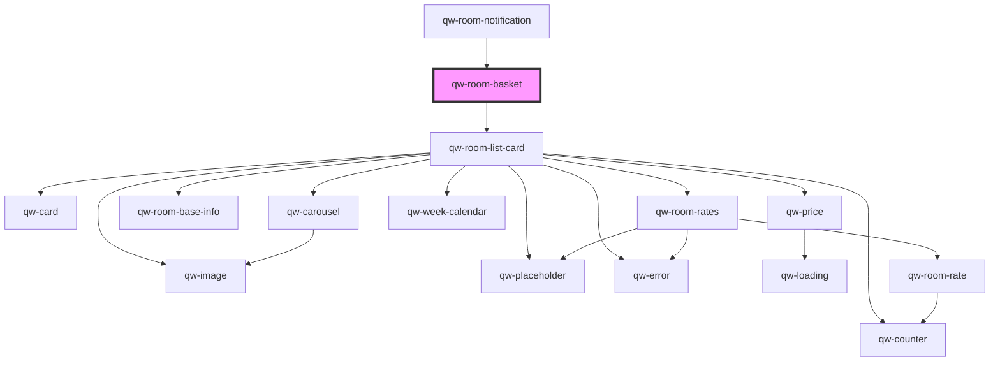

# qw-room-basket

<!-- Auto Generated Below -->

## Properties

| Property               | Attribute                  | Description | Type                                                 | Default                    |
| ---------------------- | -------------------------- | ----------- | ---------------------------------------------------- | -------------------------- |
| `qwRoomBasketHasImage` | `qw-room-basket-has-image` |             | `boolean`                                            | `true`                     |
| `qwRoomBasketType`     | `qw-room-basket-type`      |             | `QwRoomBasketType.Basic \| QwRoomBasketType.Classic` | `QwRoomBasketType.Classic` |

## Events

| Event                        | Description | Type                |
| ---------------------------- | ----------- | ------------------- |
| `qwRoomBasketBackToRoomList` |             | `CustomEvent<void>` |

## Dependencies

### Used by

 - [qw-room-notification](../qw-room-notification)

### Depends on

- [qw-room-list-card](../qw-room-list/qw-room-list-card)

### Graph

----------------------------------------------

*Built with [StencilJS](https://stenciljs.com/)*
