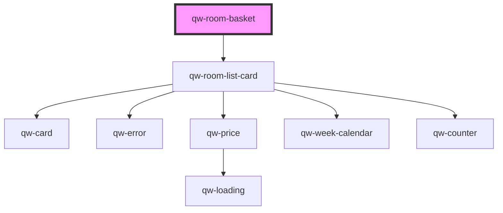

# qw-room-basket

<!-- Auto Generated Below -->

## Properties

| Property                            | Attribute                                  | Description | Type     | Default     |
| ----------------------------------- | ------------------------------------------ | ----------- | -------- | ----------- |
| `qwRoomBasketBackToRoomListMessage` | `qw-room-basket-back-to-room-list-message` |             | `string` | `undefined` |
| `qwRoomBasketShowDescription`       | `qw-room-basket-show-description`          |             | `any`    | `undefined` |

## Events

| Event                        | Description | Type                |
| ---------------------------- | ----------- | ------------------- |
| `qwRoomBasketBackToRoomList` |             | `CustomEvent<void>` |

## Dependencies

### Depends on

- [qw-room-list-card](../qw-room-list/qw-room-list-card)

### Graph

----------------------------------------------

*Built with [StencilJS](https://stenciljs.com/)*
