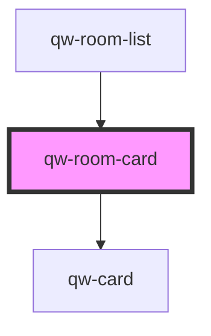

# qw-room-card

<!-- Auto Generated Below -->

## Properties

| Property            | Attribute              | Description | Type     | Default     |
| ------------------- | ---------------------- | ----------- | -------- | ----------- |
| `QwRoomCardBeds`    | `qw-room-card-beds`    |             | `string` | `undefined` |
| `QwRoomCardCaption` | `qw-room-card-caption` |             | `string` | `undefined` |
| `QwRoomCardGuests`  | `qw-room-card-guests`  |             | `string` | `undefined` |
| `QwRoomCardTitle`   | `qw-room-card-title`   |             | `string` | `undefined` |

## Events

| Event                   | Description | Type               |
| ----------------------- | ----------- | ------------------ |
| `qwRoomCardClickHeader` |             | `CustomEvent<any>` |

## Dependencies

### Used by

 - [qw-room-list](../qw-room-list)

### Depends on

- [qw-card](../shared/qw-card)

### Graph

----------------------------------------------

*Built with [StencilJS](https://stenciljs.com/)*
