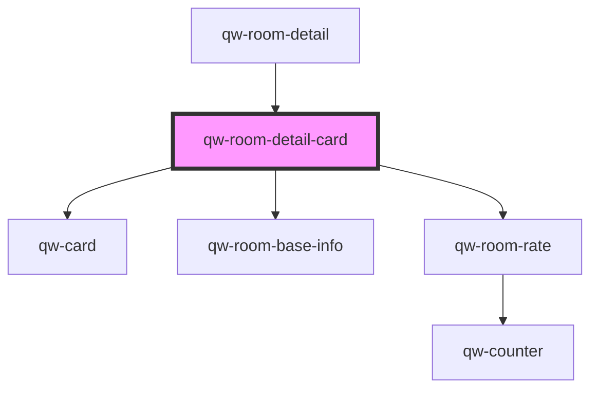

# qw-room-detail-card

<!-- Auto Generated Below -->

## Properties

| Property                         | Attribute                              | Description | Type                               | Default     |
| -------------------------------- | -------------------------------------- | ----------- | ---------------------------------- | ----------- |
| `qwRoomDetailCardBed`            | `qw-room-detail-card-bed`              |             | `string`                           | `undefined` |
| `qwRoomDetailCardGuests`         | `qw-room-detail-card-guests`           |             | `string`                           | `undefined` |
| `qwRoomDetailCardImage`          | `qw-room-detail-card-image`            |             | `string`                           | `undefined` |
| `qwRoomDetailCardIsLoading`      | `qw-room-detail-card-is-loading`       |             | `boolean`                          | `undefined` |
| `qwRoomDetailCardNumberOfNights` | `qw-room-detail-card-number-of-nights` |             | `number`                           | `undefined` |
| `qwRoomDetailCardRates`          | --                                     |             | `Rate[]`                           | `undefined` |
| `qwRoomDetailCardRatesModel`     | --                                     |             | `{ [rateId: string]: RateModel; }` | `{}`        |
| `qwRoomDetailCardRoomId`         | `qw-room-detail-card-room-id`          |             | `number`                           | `undefined` |
| `qwRoomDetailCardSquareMeter`    | `qw-room-detail-card-square-meter`     |             | `string`                           | `undefined` |
| `qwRoomDetailCardTitle`          | `qw-room-detail-card-title`            |             | `string`                           | `undefined` |

## Events

| Event                         | Description | Type                                        |
| ----------------------------- | ----------- | ------------------------------------------- |
| `qwRoomDetailCardAddToBasket` |             | `CustomEvent<QwRoomRateAddToBasketEmitter>` |

## Dependencies

### Used by

 - [qw-room-detail](..)

### Depends on

- [qw-card](../../shared/qw-card)
- [qw-room-base-info](../../qw-room-base-info)
- [qw-room-rate](../../qw-room-rate)

### Graph

----------------------------------------------

*Built with [StencilJS](https://stenciljs.com/)*
