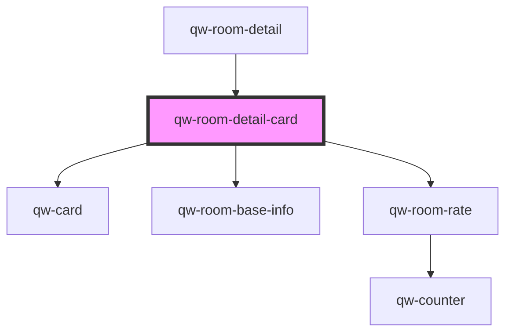

# qw-room-detail-card

<!-- Auto Generated Below -->

## Properties

| Property                                     | Attribute                                           | Description | Type      | Default     |
| -------------------------------------------- | --------------------------------------------------- | ----------- | --------- | ----------- |
| `qwRoomDetailAddAnotherRoomButtonMessage`    | `qw-room-detail-add-another-room-button-message`    |             | `string`  | `undefined` |
| `qwRoomDetailCardAlertMessage`               | `qw-room-detail-card-alert-message`                 |             | `string`  | `undefined` |
| `qwRoomDetailCardBasketRoomOccupancyText`    | `qw-room-detail-card-basket-room-occupancy-text`    |             | `string`  | `undefined` |
| `qwRoomDetailCardBed`                        | `qw-room-detail-card-bed`                           |             | `string`  | `undefined` |
| `qwRoomDetailCardGuests`                     | `qw-room-detail-card-guests`                        |             | `string`  | `undefined` |
| `qwRoomDetailCardImage`                      | `qw-room-detail-card-image`                         |             | `string`  | `undefined` |
| `qwRoomDetailCardIsLoading`                  | `qw-room-detail-card-is-loading`                    |             | `boolean` | `undefined` |
| `qwRoomDetailCardNumberOfAccommodation`      | `qw-room-detail-card-number-of-accommodation`       |             | `number`  | `undefined` |
| `qwRoomDetailCardNumberOfGuests`             | `qw-room-detail-card-number-of-guests`              |             | `number`  | `undefined` |
| `qwRoomDetailCardNumberOfNights`             | `qw-room-detail-card-number-of-nights`              |             | `number`  | `undefined` |
| `qwRoomDetailCardRates`                      | --                                                  |             | `Rate[]`  | `[]`        |
| `qwRoomDetailCardRoomId`                     | `qw-room-detail-card-room-id`                       |             | `number`  | `undefined` |
| `qwRoomDetailCardSquareMeter`                | `qw-room-detail-card-square-meter`                  |             | `string`  | `undefined` |
| `qwRoomDetailCardTitle`                      | `qw-room-detail-card-title`                         |             | `string`  | `undefined` |
| `qwRoomDetailProceedToCheckoutButtonMessage` | `qw-room-detail-proceed-to-checkout-button-message` |             | `string`  | `undefined` |

## Events

| Event                            | Description | Type                                          |
| -------------------------------- | ----------- | --------------------------------------------- |
| `qwRoomDetailCardAddAnotherRoom` |             | `CustomEvent<void>`                           |
| `qwRoomDetailCardAddedToBasket`  |             | `CustomEvent<QwRoomRateAddedToBasketEmitter>` |
| `qwRoomDetailCardProceed`        |             | `CustomEvent<void>`                           |

## Dependencies

### Used by

 - [qw-room-detail](..)

### Depends on

- [qw-card](../../shared/qw-card)
- [qw-room-base-info](../../qw-room-base-info)
- [qw-room-rate](../../qw-room-rate)

### Graph

----------------------------------------------

*Built with [StencilJS](https://stenciljs.com/)*
