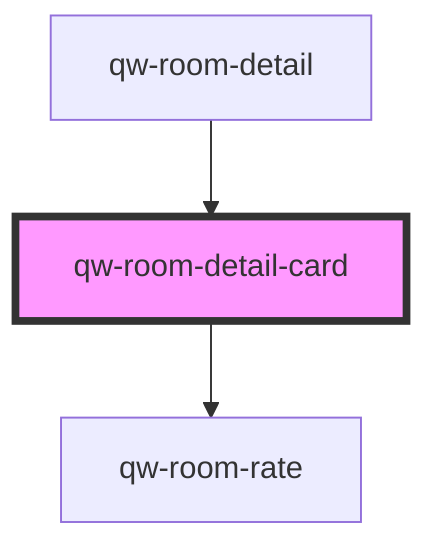

# qw-room-detail-card

<!-- Auto Generated Below -->

## Properties

| Property                       | Attribute                          | Description | Type     | Default     |
| ------------------------------ | ---------------------------------- | ----------- | -------- | ----------- |
| `qwRoomDetailCardAvailability` | `qw-room-detail-card-availability` |             | `string` | `undefined` |
| `qwRoomDetailCardImage`        | `qw-room-detail-card-image`        |             | `string` | `undefined` |
| `qwRoomDetailCardRates`        | --                                 |             | `Rate[]` | `undefined` |
| `qwRoomDetailCardTitle`        | `qw-room-detail-card-title`        |             | `string` | `undefined` |

## Events

| Event                         | Description | Type                                        |
| ----------------------------- | ----------- | ------------------------------------------- |
| `qwRoomDetailCardAddToBasket` |             | `CustomEvent<QwRoomRateAddToBasketEmitter>` |

## Dependencies

### Used by

 - [qw-room-detail](..)

### Depends on

- [qw-room-rate](../../qw-room-rate)

### Graph

----------------------------------------------

*Built with [StencilJS](https://stenciljs.com/)*
