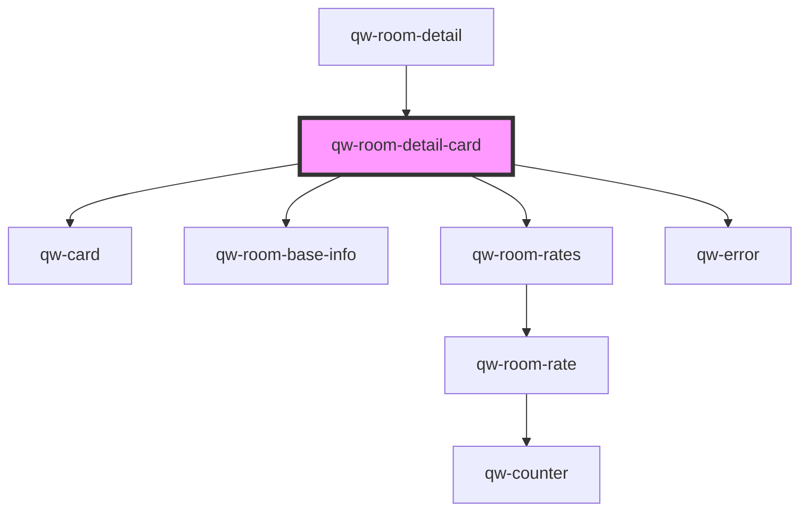

# qw-room-detail-card

<!-- Auto Generated Below -->

## Properties

| Property                                | Attribute                                     | Description | Type      | Default     |
| --------------------------------------- | --------------------------------------------- | ----------- | --------- | ----------- |
| `qwRoomDetailCardImage`                 | `qw-room-detail-card-image`                   |             | `string`  | `undefined` |
| `qwRoomDetailCardIsLoading`             | `qw-room-detail-card-is-loading`              |             | `boolean` | `undefined` |
| `qwRoomDetailCardNumberOfAccommodation` | `qw-room-detail-card-number-of-accommodation` |             | `number`  | `undefined` |
| `qwRoomDetailCardNumberOfGuests`        | `qw-room-detail-card-number-of-guests`        |             | `number`  | `undefined` |
| `qwRoomDetailCardNumberOfNights`        | `qw-room-detail-card-number-of-nights`        |             | `number`  | `undefined` |
| `qwRoomDetailCardRates`                 | --                                            |             | `Rate[]`  | `[]`        |
| `qwRoomDetailCardRoomId`                | `qw-room-detail-card-room-id`                 |             | `number`  | `undefined` |
| `qwRoomDetailCardTitle`                 | `qw-room-detail-card-title`                   |             | `string`  | `undefined` |

## Events

| Event                            | Description | Type                                          |
| -------------------------------- | ----------- | --------------------------------------------- |
| `qwRoomDetailCardAddAnotherRoom` |             | `CustomEvent<void>`                           |
| `qwRoomDetailCardAddedToBasket`  |             | `CustomEvent<QwRoomRateAddedToBasketEmitter>` |
| `qwRoomDetailCardProceed`        |             | `CustomEvent<void>`                           |

## Dependencies

### Used by

 - [qw-room-detail](..)

### Depends on

- [qw-card](../../shared/qw-card)
- [qw-room-base-info](../../qw-room-base-info)
- [qw-room-rates](../../qw-room-rates)
- [qw-error](../../shared/qw-error)

### Graph

----------------------------------------------

*Built with [StencilJS](https://stenciljs.com/)*
