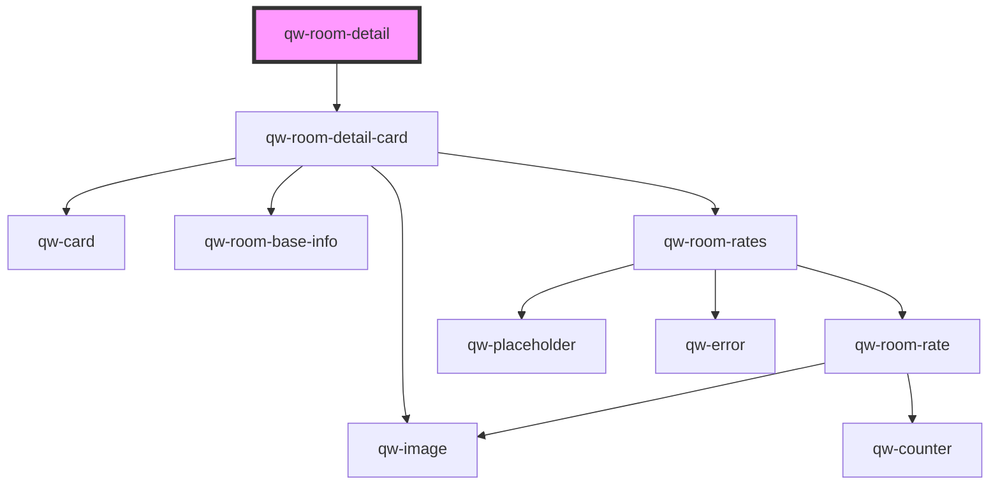

# qw-room-detail

<!-- Auto Generated Below -->

## Properties

| Property                                 | Attribute                                     | Description | Type     | Default     |
| ---------------------------------------- | --------------------------------------------- | ----------- | -------- | ----------- |
| `qwRoomDetailId`                         | `qw-room-detail-id`                           |             | `string` | `undefined` |
| `qwRoomDetailImageTransformationOptions` | `qw-room-detail-image-transformation-options` |             | `string` | `undefined` |
| `qwRoomDetailRateHighlight`              | `qw-room-detail-rate-highlight`               |             | `string` | `undefined` |

## Events

| Event                            | Description | Type                                          |
| -------------------------------- | ----------- | --------------------------------------------- |
| `qwRoomDetailAddAnotherRoom`     |             | `CustomEvent<void>`                           |
| `qwRoomDetailAddToBasketSuccess` |             | `CustomEvent<QwRoomDetailAddToBasketEmitter>` |
| `qwRoomDetailProceed`            |             | `CustomEvent<void>`                           |

## Dependencies

### Depends on

- [qw-room-detail-card](qw-room-detail-card)

### Graph

----------------------------------------------

*Built with [StencilJS](https://stenciljs.com/)*
