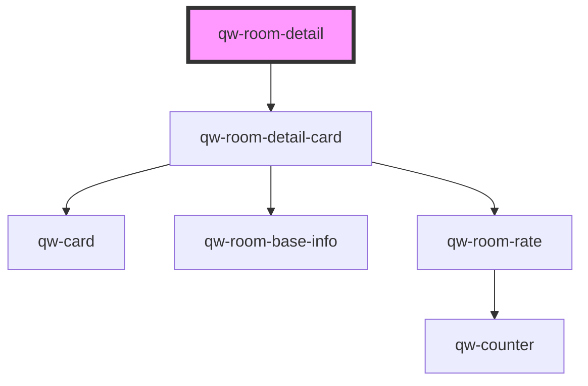

# qw-room-detail

<!-- Auto Generated Below -->

## Properties

| Property         | Attribute           | Description | Type     | Default     |
| ---------------- | ------------------- | ----------- | -------- | ----------- |
| `qwRoomDetailId` | `qw-room-detail-id` |             | `string` | `undefined` |

## Events

| Event                            | Description | Type                                          |
| -------------------------------- | ----------- | --------------------------------------------- |
| `qwRoomDetailAddToBasketSuccess` |             | `CustomEvent<QwRoomDetailAddToBasketEmitter>` |

## Dependencies

### Depends on

- [qw-room-detail-card](qw-room-detail-card)

### Graph

----------------------------------------------

*Built with [StencilJS](https://stenciljs.com/)*
