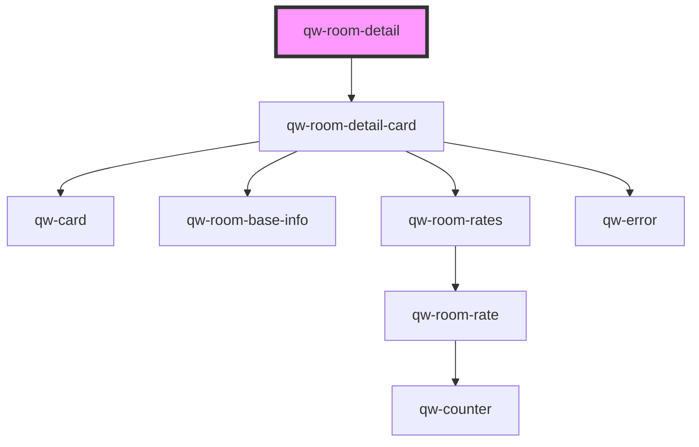

# qw-room-detail

<!-- Auto Generated Below -->

## Properties

| Property                      | Attribute                          | Description | Type      | Default     |
| ----------------------------- | ---------------------------------- | ----------- | --------- | ----------- |
| `qwRoomDetailForceBasketCall` | `qw-room-detail-force-basket-call` |             | `boolean` | `false`     |
| `qwRoomDetailId`              | `qw-room-detail-id`                |             | `string`  | `undefined` |

## Events

| Event                            | Description | Type                                          |
| -------------------------------- | ----------- | --------------------------------------------- |
| `qwRoomDetailAddAnotherRoom`     |             | `CustomEvent<void>`                           |
| `qwRoomDetailAddToBasketSuccess` |             | `CustomEvent<QwRoomDetailAddToBasketEmitter>` |
| `qwRoomDetailProceed`            |             | `CustomEvent<void>`                           |

## Dependencies

### Depends on

- [qw-room-detail-card](qw-room-detail-card)

### Graph

----------------------------------------------

*Built with [StencilJS](https://stenciljs.com/)*
