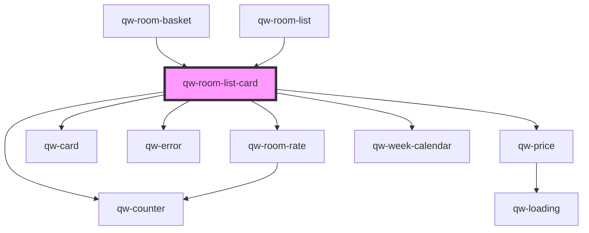

# qw-room-card

<!-- Auto Generated Below -->

## Properties

| Property                              | Attribute                                    | Description | Type                                    | Default     |
| ------------------------------------- | -------------------------------------------- | ----------- | --------------------------------------- | ----------- |
| `qwRoomListCardAddableLeftover`       | `qw-room-list-card-addable-leftover`         |             | `number`                                | `0`         |
| `qwRoomListCardAveragePrice`          | `qw-room-list-card-average-price`            |             | `string`                                | `undefined` |
| `qwRoomListCardBasketIsEmpty`         | `qw-room-list-card-basket-is-empty`          |             | `boolean`                               | `undefined` |
| `qwRoomListCardBasketRoom`            | --                                           |             | `RoomBasketModel`                       | `undefined` |
| `qwRoomListCardBasketRoomOccupancyId` | `qw-room-list-card-basket-room-occupancy-id` |             | `number`                                | `undefined` |
| `qwRoomListCardCrossedOutPrice`       | `qw-room-list-card-crossed-out-price`        |             | `string`                                | `undefined` |
| `qwRoomListCardDescription`           | `qw-room-list-card-description`              |             | `string`                                | `undefined` |
| `qwRoomListCardGuests`                | `qw-room-list-card-guests`                   |             | `string`                                | `undefined` |
| `qwRoomListCardId`                    | `qw-room-list-card-id`                       |             | `number`                                | `undefined` |
| `qwRoomListCardImage`                 | `qw-room-list-card-image`                    |             | `string`                                | `undefined` |
| `qwRoomListCardIsLoading`             | `qw-room-list-card-is-loading`               |             | `boolean`                               | `undefined` |
| `qwRoomListCardIsLoadingBasket`       | `qw-room-list-card-is-loading-basket`        |             | `boolean`                               | `undefined` |
| `qwRoomListCardIsLoadingPrice`        | `qw-room-list-card-is-loading-price`         |             | `boolean`                               | `undefined` |
| `qwRoomListCardNights`                | `qw-room-list-card-nights`                   |             | `number`                                | `undefined` |
| `qwRoomListCardOnChangeRoom`          | --                                           |             | `(e: QwChangeRoomEvent) => void`        | `undefined` |
| `qwRoomListCardOnClickBook`           | --                                           |             | `() => void`                            | `undefined` |
| `qwRoomListCardOnClickChangeDate`     | --                                           |             | `() => void`                            | `undefined` |
| `qwRoomListCardOnClickView`           | --                                           |             | `() => void`                            | `undefined` |
| `qwRoomListCardPrice`                 | `qw-room-list-card-price`                    |             | `string`                                | `undefined` |
| `qwRoomListCardPrices`                | --                                           |             | `{ [dateString: string]: MoneyPrice; }` | `undefined` |
| `qwRoomListCardRangeDate`             | --                                           |             | `Date[]`                                | `undefined` |
| `qwRoomListCardRangeDateSession`      | --                                           |             | `Date[]`                                | `undefined` |
| `qwRoomListCardRates`                 | --                                           |             | `Rate[]`                                | `undefined` |
| `qwRoomListCardShowActions`           | `qw-room-list-card-show-actions`             |             | `boolean`                               | `undefined` |
| `qwRoomListCardShowCta`               | `qw-room-list-card-show-cta`                 |             | `boolean`                               | `true`      |
| `qwRoomListCardShowDescription`       | `qw-room-list-card-show-description`         |             | `boolean`                               | `true`      |
| `qwRoomListCardShowPrice`             | `qw-room-list-card-show-price`               |             | `boolean`                               | `true`      |
| `qwRoomListCardShowPriceAndTaxes`     | `qw-room-list-card-show-price-and-taxes`     |             | `boolean`                               | `undefined` |
| `qwRoomListCardShowPrices`            | `qw-room-list-card-show-prices`              |             | `boolean`                               | `true`      |
| `qwRoomListCardSquareMeter`           | `qw-room-list-card-square-meter`             |             | `string`                                | `undefined` |
| `qwRoomListCardTaxes`                 | `qw-room-list-card-taxes`                    |             | `string`                                | `undefined` |
| `qwRoomListCardTitle`                 | `qw-room-list-card-title`                    |             | `string`                                | `undefined` |

## Dependencies

### Used by

 - [qw-room-basket](../../qw-room-basket)
 - [qw-room-list](..)

### Depends on

- [qw-room-rate](../../qw-room-rate)
- [qw-card](../../shared/qw-card)
- [qw-error](../../shared/qw-error)
- [qw-price](../../qw-price)
- [qw-week-calendar](../../qw-week-calendar)
- [qw-counter](../../shared/qw-counter)

### Graph

----------------------------------------------

*Built with [StencilJS](https://stenciljs.com/)*
