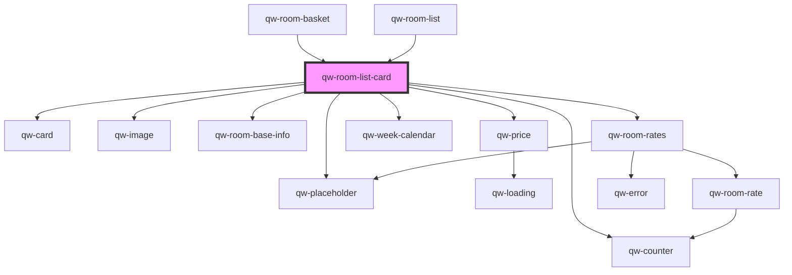

# qw-room-card

<!-- Auto Generated Below -->

## Properties

| Property                                   | Attribute                                   | Description | Type                                                                  | Default                     |
| ------------------------------------------ | ------------------------------------------- | ----------- | --------------------------------------------------------------------- | --------------------------- |
| `qwRoomListCardAddableLeftover`            | `qw-room-list-card-addable-leftover`        |             | `number`                                                              | `0`                         |
| `qwRoomListCardAveragePrice`               | `qw-room-list-card-average-price`           |             | `string`                                                              | `undefined`                 |
| `qwRoomListCardBaseInfoType`               | `qw-room-list-card-base-info-type`          |             | `QwRoomBaseInfoType.Inline \| QwRoomBaseInfoType.List`                | `QwRoomBaseInfoType.Inline` |
| `qwRoomListCardBasketIsEmpty`              | `qw-room-list-card-basket-is-empty`         |             | `boolean`                                                             | `undefined`                 |
| `qwRoomListCardBasketRoom`                 | --                                          |             | `RoomBasketModel`                                                     | `undefined`                 |
| `qwRoomListCardCrossedOutPrice`            | `qw-room-list-card-crossed-out-price`       |             | `string`                                                              | `undefined`                 |
| `qwRoomListCardDescription`                | `qw-room-list-card-description`             |             | `string`                                                              | `undefined`                 |
| `qwRoomListCardId`                         | `qw-room-list-card-id`                      |             | `number`                                                              | `undefined`                 |
| `qwRoomListCardImage`                      | `qw-room-list-card-image`                   |             | `string`                                                              | `undefined`                 |
| `qwRoomListCardImageTransformationOptions` | --                                          |             | `Options`                                                             | `{}`                        |
| `qwRoomListCardIsLoading`                  | `qw-room-list-card-is-loading`              |             | `boolean`                                                             | `undefined`                 |
| `qwRoomListCardIsLoadingPrice`             | `qw-room-list-card-is-loading-price`        |             | `boolean`                                                             | `undefined`                 |
| `qwRoomListCardLanguage`                   | `qw-room-list-card-language`                |             | `string`                                                              | `undefined`                 |
| `qwRoomListCardNights`                     | `qw-room-list-card-nights`                  |             | `number`                                                              | `undefined`                 |
| `qwRoomListCardNumberOfAccommodation`      | `qw-room-list-card-number-of-accommodation` |             | `number`                                                              | `undefined`                 |
| `qwRoomListCardNumberOfGuests`             | `qw-room-list-card-number-of-guests`        |             | `number`                                                              | `undefined`                 |
| `qwRoomListCardOnAddedToBasket`            | --                                          |             | `(e: BasketModel) => void`                                            | `undefined`                 |
| `qwRoomListCardOnChangeRoom`               | --                                          |             | `(e: QwChangeRoomEvent) => void`                                      | `undefined`                 |
| `qwRoomListCardOnChangeWeekDates`          | --                                          |             | `(e: QwWeekCalendarDirection) => void`                                | `undefined`                 |
| `qwRoomListCardOnClickBook`                | --                                          |             | `() => void`                                                          | `undefined`                 |
| `qwRoomListCardOnClickChangeDate`          | --                                          |             | `() => void`                                                          | `undefined`                 |
| `qwRoomListCardOnClickView`                | --                                          |             | `() => void`                                                          | `undefined`                 |
| `qwRoomListCardOnProceedToCheckout`        | --                                          |             | `() => void`                                                          | `undefined`                 |
| `qwRoomListCardPlaceholders`               | `qw-room-list-card-placeholders`            |             | `string`                                                              | `undefined`                 |
| `qwRoomListCardPrice`                      | `qw-room-list-card-price`                   |             | `string`                                                              | `undefined`                 |
| `qwRoomListCardPrices`                     | --                                          |             | `{ [dateString: string]: MoneyPrice; }`                               | `undefined`                 |
| `qwRoomListCardRangeDate`                  | --                                          |             | `Date[]`                                                              | `undefined`                 |
| `qwRoomListCardRangeDateSession`           | --                                          |             | `Date[]`                                                              | `undefined`                 |
| `qwRoomListCardShowActions`                | `qw-room-list-card-show-actions`            |             | `boolean`                                                             | `undefined`                 |
| `qwRoomListCardShowCta`                    | `qw-room-list-card-show-cta`                |             | `boolean`                                                             | `true`                      |
| `qwRoomListCardShowDescription`            | `qw-room-list-card-show-description`        |             | `boolean`                                                             | `true`                      |
| `qwRoomListCardShowPrice`                  | `qw-room-list-card-show-price`              |             | `boolean`                                                             | `true`                      |
| `qwRoomListCardShowPriceAndTaxes`          | `qw-room-list-card-show-price-and-taxes`    |             | `boolean`                                                             | `undefined`                 |
| `qwRoomListCardShowPrices`                 | `qw-room-list-card-show-prices`             |             | `boolean`                                                             | `true`                      |
| `qwRoomListCardShowRates`                  | `qw-room-list-card-show-rates`              |             | `boolean`                                                             | `undefined`                 |
| `qwRoomListCardTaxes`                      | `qw-room-list-card-taxes`                   |             | `string`                                                              | `undefined`                 |
| `qwRoomListCardTitle`                      | `qw-room-list-card-title`                   |             | `string`                                                              | `undefined`                 |
| `qwRoomListCardType`                       | `qw-room-list-card-type`                    |             | `QwRoomListType.Card \| QwRoomListType.Grid \| QwRoomListType.Inline` | `QwRoomListType.Inline`     |

## Dependencies

### Used by

 - [qw-room-basket](../../qw-room-basket)
 - [qw-room-list](..)

### Depends on

- [qw-card](../../shared/qw-card)
- [qw-image](../../shared/qw-image)
- [qw-room-base-info](../../qw-room-base-info)
- [qw-placeholder](../../shared/qw-placeholder)
- [qw-price](../../qw-price)
- [qw-week-calendar](../../qw-week-calendar)
- [qw-room-rates](../../qw-room-rates)
- [qw-counter](../../shared/qw-counter)

### Graph

----------------------------------------------

*Built with [StencilJS](https://stenciljs.com/)*
