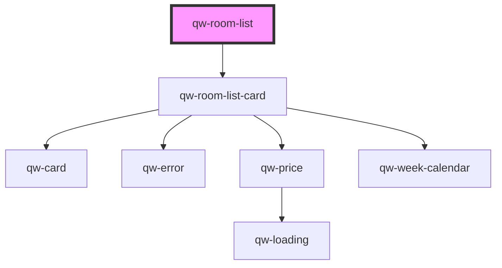

# qw-room-list

<!-- Auto Generated Below -->

## Properties

| Property                    | Attribute                        | Description | Type                                           | Default                 |
| --------------------------- | -------------------------------- | ----------- | ---------------------------------------------- | ----------------------- |
| `qwRoomListFilterRoomsWith` | `qw-room-list-filter-rooms-with` |             | `string`                                       | `undefined`             |
| `qwRoomListHeaderMessage`   | `qw-room-list-header-message`    |             | `string`                                       | `undefined`             |
| `qwRoomListShowCta`         | `qw-room-list-show-cta`          |             | `boolean`                                      | `true`                  |
| `qwRoomListShowPrices`      | `qw-room-list-show-prices`       |             | `boolean`                                      | `true`                  |
| `qwRoomListType`            | `qw-room-list-type`              |             | `QwRoomListType.Grid \| QwRoomListType.Inline` | `QwRoomListType.Inline` |

## Events

| Event                 | Description | Type                                                                |
| --------------------- | ----------- | ------------------------------------------------------------------- |
| `qwRoomListClickRoom` |             | `CustomEvent<{ type: QwRoomListCardButtonType; room: RoomModel; }>` |

## Dependencies

### Depends on

- [qw-room-list-card](qw-room-list-card)

### Graph

----------------------------------------------

*Built with [StencilJS](https://stenciljs.com/)*
