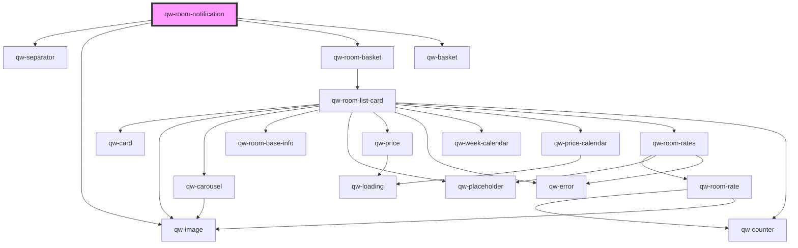

# qw-room-notification

<!-- Auto Generated Below -->

## Properties

| Property                          | Attribute                              | Description | Type     | Default |
| --------------------------------- | -------------------------------------- | ----------- | -------- | ------- |
| `qwRoomNotificationShowPopupTime` | `qw-room-notification-show-popup-time` |             | `number` | `3000`  |

## Dependencies

### Depends on

- [qw-separator](../shared/qw-separator)
- [qw-image](../shared/qw-image)
- [qw-room-basket](../qw-room-basket)
- [qw-basket](../qw-basket)

### Graph

----------------------------------------------

*Built with [StencilJS](https://stenciljs.com/)*
