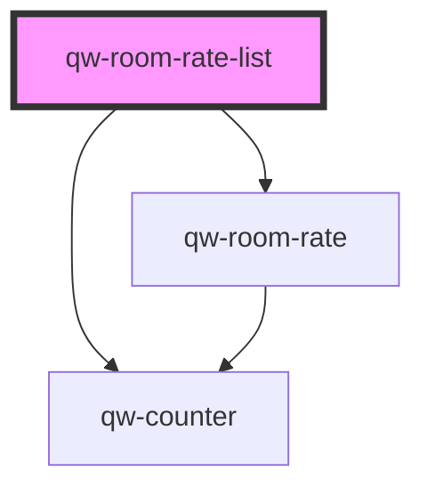

# qw-room-rate-list

<!-- Auto Generated Below -->

## Properties

| Property           | Attribute              | Description | Type     | Default     |
| ------------------ | ---------------------- | ----------- | -------- | ----------- |
| `qwRoomRateListId` | `qw-room-rate-list-id` |             | `string` | `undefined` |

## Dependencies

### Depends on

- [qw-counter](../shared/qw-counter)
- [qw-room-rate](../qw-room-rate)

### Graph

----------------------------------------------

*Built with [StencilJS](https://stenciljs.com/)*
