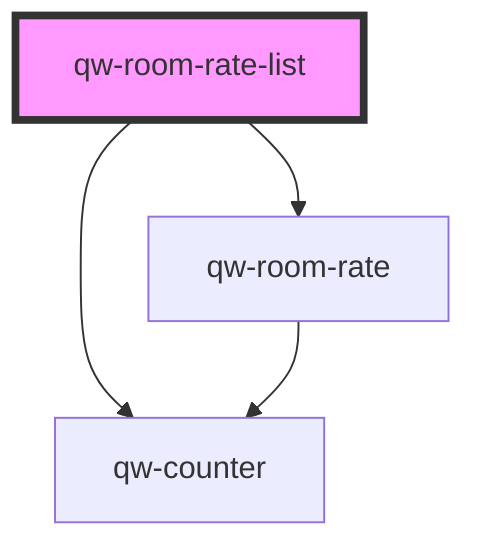

# qw-room-rate-list

<!-- Auto Generated Below -->

## Properties

| Property                                       | Attribute                                              | Description | Type      | Default     |
| ---------------------------------------------- | ------------------------------------------------------ | ----------- | --------- | ----------- |
| `qwRoomRateListAddAnotherRoomButtonMessage`    | `qw-room-rate-list-add-another-room-button-message`    |             | `string`  | `undefined` |
| `qwRoomRateListAlertMessage`                   | `qw-room-rate-list-alert-message`                      |             | `string`  | `undefined` |
| `qwRoomRateListDefaultToOne`                   | `qw-room-rate-list-default-to-one`                     |             | `boolean` | `false`     |
| `qwRoomRateListId`                             | `qw-room-rate-list-id`                                 |             | `string`  | `undefined` |
| `qwRoomRateListProceedToCheckoutButtonMessage` | `qw-room-rate-list-proceed-to-checkout-button-message` |             | `string`  | `undefined` |

## Events

| Event                          | Description | Type                |
| ------------------------------ | ----------- | ------------------- |
| `qwRoomRateListAddAnotherRoom` |             | `CustomEvent<void>` |
| `qwRoomRateListProceed`        |             | `CustomEvent<void>` |

## Dependencies

### Depends on

- [qw-room-rate](../qw-room-rate)
- [qw-counter](../shared/qw-counter)

### Graph

----------------------------------------------

*Built with [StencilJS](https://stenciljs.com/)*
