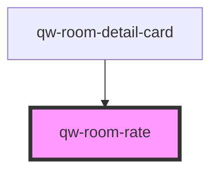

# qw-room-rate

<!-- Auto Generated Below -->

## Properties

| Property         | Attribute | Description | Type   | Default     |
| ---------------- | --------- | ----------- | ------ | ----------- |
| `qwRoomRateRate` | --        |             | `Rate` | `undefined` |

## Events

| Event                   | Description | Type                                        |
| ----------------------- | ----------- | ------------------------------------------- |
| `qwRoomRateAddToBasket` |             | `CustomEvent<QwRoomRateAddToBasketEmitter>` |

## Dependencies

### Used by

 - [qw-room-detail-card](../qw-room-detail/qw-room-detail-card)

### Graph

----------------------------------------------

*Built with [StencilJS](https://stenciljs.com/)*
