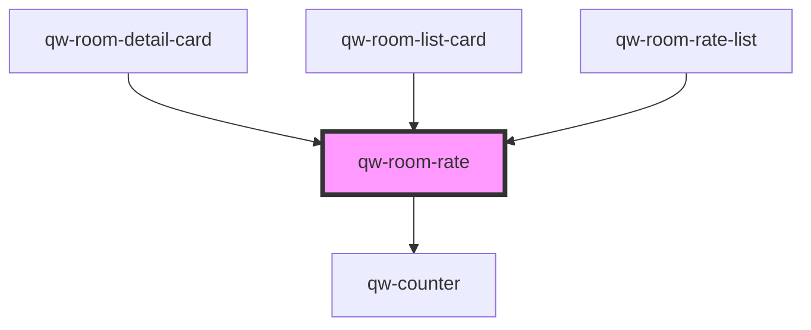

# qw-room-rate

<!-- Auto Generated Below -->

## Properties

| Property                            | Attribute                                 | Description | Type      | Default     |
| ----------------------------------- | ----------------------------------------- | ----------- | --------- | ----------- |
| `qwRoomRateIsDisabled`              | `qw-room-rate-is-disabled`                |             | `boolean` | `undefined` |
| `qwRoomRateIsLoading`               | `qw-room-rate-is-loading`                 |             | `boolean` | `undefined` |
| `qwRoomRateRate`                    | --                                        |             | `Rate`    | `undefined` |
| `qwRoomRateRoomBasketOccupancyText` | `qw-room-rate-room-basket-occupancy-text` |             | `string`  | `undefined` |
| `qwRoomRateRoomId`                  | `qw-room-rate-room-id`                    |             | `number`  | `undefined` |
| `qwRoomRateShowConditions`          | `qw-room-rate-show-conditions`            |             | `boolean` | `undefined` |

## Events

| Event                      | Description | Type                                           |
| -------------------------- | ----------- | ---------------------------------------------- |
| `qwRoomRateAddedToBasket`  |             | `CustomEvent<QwRoomRateAddedToBasketEmitter>`  |
| `qwRoomRateCounterChanged` |             | `CustomEvent<QwRoomRateCounterChangedEmitter>` |

## Dependencies

### Used by

 - [qw-room-detail-card](../qw-room-detail/qw-room-detail-card)
 - [qw-room-list-card](../qw-room-list/qw-room-list-card)
 - [qw-room-rate-list](../qw-room-rate-list)

### Depends on

- [qw-counter](../shared/qw-counter)

### Graph

----------------------------------------------

*Built with [StencilJS](https://stenciljs.com/)*
