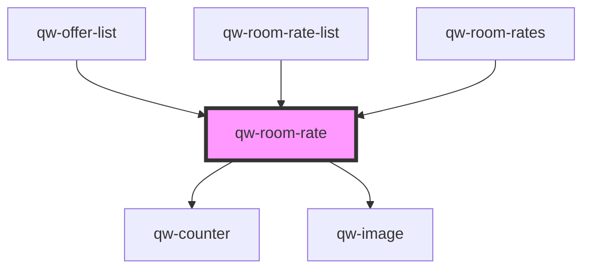

# qw-room-rate

<!-- Auto Generated Below -->

## Properties

| Property                     | Attribute                          | Description | Type                                                                  | Default                 |
| ---------------------------- | ---------------------------------- | ----------- | --------------------------------------------------------------------- | ----------------------- |
| `qwRoomRateDefaultToOne`     | `qw-room-rate-default-to-one`      |             | `boolean`                                                             | `false`                 |
| `qwRoomRateHighlight`        | `qw-room-rate-highlight`           |             | `string`                                                              | `undefined`             |
| `qwRoomRateIsAddingToBasket` | `qw-room-rate-is-adding-to-basket` |             | `boolean`                                                             | `undefined`             |
| `qwRoomRateIsDisabled`       | `qw-room-rate-is-disabled`         |             | `boolean`                                                             | `undefined`             |
| `qwRoomRateIsLoading`        | `qw-room-rate-is-loading`          |             | `boolean`                                                             | `undefined`             |
| `qwRoomRateRate`             | --                                 |             | `Rate`                                                                | `undefined`             |
| `qwRoomRateRoomId`           | `qw-room-rate-room-id`             |             | `number`                                                              | `undefined`             |
| `qwRoomRateShowConditions`   | `qw-room-rate-show-conditions`     |             | `boolean`                                                             | `undefined`             |
| `qwRoomRateType`             | `qw-room-rate-type`                |             | `QwRoomListType.Card \| QwRoomListType.Grid \| QwRoomListType.Inline` | `QwRoomListType.Inline` |

## Events

| Event                      | Description | Type                                           |
| -------------------------- | ----------- | ---------------------------------------------- |
| `qwRoomAddedToBasket`      |             | `CustomEvent<QwRoomTrackingDataEmitter>`       |
| `qwRoomRateAddedToBasket`  |             | `CustomEvent<QwRoomRateAddedToBasketEmitter>`  |
| `qwRoomRateCounterChanged` |             | `CustomEvent<QwRoomRateCounterChangedEmitter>` |
| `qwRoomRemovedFromBasket`  |             | `CustomEvent<QwRoomTrackingDataEmitter>`       |

## Dependencies

### Used by

 - [qw-offer-list](../qw-offer-list)
 - [qw-room-rate-list](../qw-room-rate-list)
 - [qw-room-rates](../qw-room-rates)

### Depends on

- [qw-counter](../shared/qw-counter)
- [qw-image](../shared/qw-image)

### Graph

----------------------------------------------

*Built with [StencilJS](https://stenciljs.com/)*
