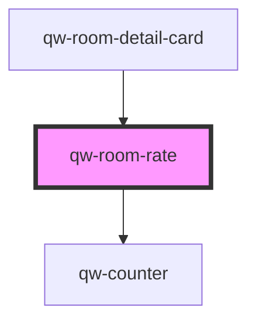

# qw-room-rate

<!-- Auto Generated Below -->

## Properties

| Property               | Attribute                  | Description | Type      | Default     |
| ---------------------- | -------------------------- | ----------- | --------- | ----------- |
| `qwRoomRateIsDisabled` | `qw-room-rate-is-disabled` |             | `boolean` | `undefined` |
| `qwRoomRateIsLoading`  | `qw-room-rate-is-loading`  |             | `boolean` | `undefined` |
| `qwRoomRateName`       | `qw-room-rate-name`        |             | `string`  | `undefined` |
| `qwRoomRateQualifier`  | `qw-room-rate-qualifier`   |             | `string`  | `undefined` |
| `qwRoomRateRate`       | --                         |             | `Rate`    | `undefined` |
| `qwRoomRateSummary`    | `qw-room-rate-summary`     |             | `string`  | `undefined` |

## Events

| Event                      | Description | Type                                        |
| -------------------------- | ----------- | ------------------------------------------- |
| `qwRoomRateAddToBasket`    |             | `CustomEvent<QwRoomRateAddToBasketEmitter>` |
| `qwRoomRateCounterChanged` |             | `CustomEvent<QwRoomRateAddToBasketEmitter>` |

## Dependencies

### Used by

 - [qw-room-detail-card](../qw-room-detail/qw-room-detail-card)

### Depends on

- [qw-counter](../shared/qw-counter)

### Graph

----------------------------------------------

*Built with [StencilJS](https://stenciljs.com/)*
