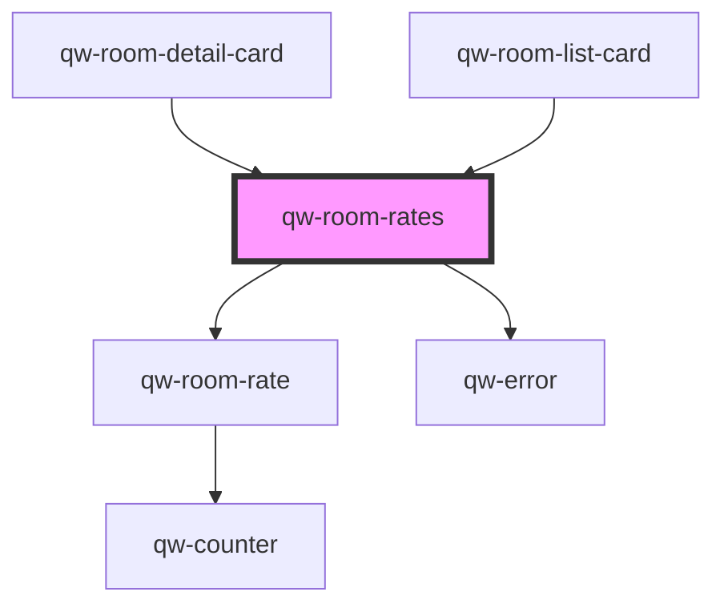

# qw-room-rates

<!-- Auto Generated Below -->

## Properties

| Property            | Attribute               | Description | Type                                                                  | Default                 |
| ------------------- | ----------------------- | ----------- | --------------------------------------------------------------------- | ----------------------- |
| `qwRoomRatesRates`  | --                      |             | `Rate[]`                                                              | `[]`                    |
| `qwRoomRatesRoomId` | `qw-room-rates-room-id` |             | `number`                                                              | `undefined`             |
| `qwRoomRatesType`   | `qw-room-rates-type`    |             | `QwRoomListType.Card \| QwRoomListType.Grid \| QwRoomListType.Inline` | `QwRoomListType.Inline` |

## Dependencies

### Used by

 - [qw-room-detail-card](../qw-room-detail/qw-room-detail-card)
 - [qw-room-list-card](../qw-room-list/qw-room-list-card)

### Depends on

- [qw-room-rate](../qw-room-rate)
- [qw-error](../shared/qw-error)

### Graph

----------------------------------------------

*Built with [StencilJS](https://stenciljs.com/)*
