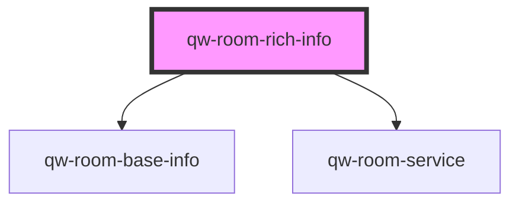

# qw-room-rich-info

<!-- Auto Generated Below -->

## Properties

| Property                       | Attribute                            | Description | Type                                                   | Default                     |
| ------------------------------ | ------------------------------------ | ----------- | ------------------------------------------------------ | --------------------------- |
| `qwRoomRichInfoBaseInfoType`   | `qw-room-rich-info-base-info-type`   |             | `QwRoomBaseInfoType.Inline \| QwRoomBaseInfoType.List` | `QwRoomBaseInfoType.Inline` |
| `qwRoomRichInfoForceRoomsCall` | `qw-room-rich-info-force-rooms-call` |             | `boolean`                                              | `false`                     |
| `qwRoomRichInfoRoomId`         | `qw-room-rich-info-room-id`          |             | `string`                                               | `undefined`                 |

## Events

| Event                  | Description | Type                |
| ---------------------- | ----------- | ------------------- |
| `qwRoomRichInfoOnLoad` |             | `CustomEvent<void>` |

## Dependencies

### Depends on

- [qw-room-base-info](../qw-room-base-info)
- [qw-room-service](../qw-room-service)

### Graph

----------------------------------------------

*Built with [StencilJS](https://stenciljs.com/)*
