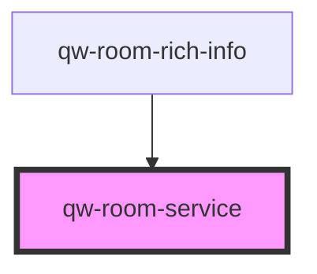

# qw-room-service

<!-- Auto Generated Below -->

## Properties

| Property                      | Attribute                          | Description | Type      | Default     |
| ----------------------------- | ---------------------------------- | ----------- | --------- | ----------- |
| `qwRoomServiceForceRoomsCall` | `qw-room-service-force-rooms-call` |             | `boolean` | `false`     |
| `qwRoomServiceRoomId`         | `qw-room-service-room-id`          |             | `string`  | `undefined` |

## Dependencies

### Used by

 - [qw-room-rich-info](../qw-room-rich-info)

### Graph

----------------------------------------------

*Built with [StencilJS](https://stenciljs.com/)*
