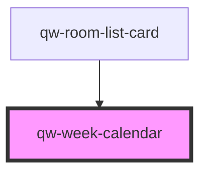

# qw-week-calendar

<!-- Auto Generated Below -->

## Properties

| Property                         | Attribute                           | Description | Type                                    | Default     |
| -------------------------------- | ----------------------------------- | ----------- | --------------------------------------- | ----------- |
| `qwWeekCalendarIsLoading`        | `qw-week-calendar-is-loading`       |             | `boolean`                               | `undefined` |
| `qwWeekCalendarLanguage`         | `qw-week-calendar-language`         |             | `string`                                | `undefined` |
| `qwWeekCalendarPricesByRoom`     | --                                  |             | `{ [dateString: string]: MoneyPrice; }` | `{}`        |
| `qwWeekCalendarRangeDate`        | --                                  |             | `Date[]`                                | `undefined` |
| `qwWeekCalendarRangeDateSession` | --                                  |             | `Date[]`                                | `undefined` |
| `qwWeekCalendarSelectedRoomId`   | `qw-week-calendar-selected-room-id` |             | `number`                                | `undefined` |

## Events

| Event                       | Description | Type                                                                         |
| --------------------------- | ----------- | ---------------------------------------------------------------------------- |
| `qwWeekCalendarChangeDates` |             | `CustomEvent<QwWeekCalendarDirection.Left \| QwWeekCalendarDirection.Right>` |

## Dependencies

### Used by

 - [qw-room-list-card](../qw-room-list/qw-room-list-card)

### Graph

----------------------------------------------

*Built with [StencilJS](https://stenciljs.com/)*
