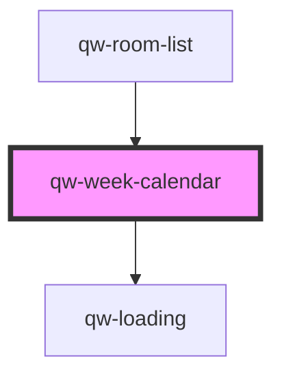

# qw-week-calendar

<!-- Auto Generated Below -->

## Properties

| Property                         | Attribute                           | Description | Type      | Default     |
| -------------------------------- | ----------------------------------- | ----------- | --------- | ----------- |
| `qwWeekCalendarIsPriceLoading`   | `qw-week-calendar-is-price-loading` |             | `boolean` | `undefined` |
| `qwWeekCalendarPricesByRoom`     | `qw-week-calendar-prices-by-room`   |             | `any`     | `undefined` |
| `qwWeekCalendarRangeDate`        | --                                  |             | `Date[]`  | `undefined` |
| `qwWeekCalendarRangeDateSession` | --                                  |             | `Date[]`  | `undefined` |
| `qwWeekCalendarSelectedRoomId`   | `qw-week-calendar-selected-room-id` |             | `number`  | `undefined` |

## Dependencies

### Used by

 - [qw-room-list](../qw-room-list)

### Depends on

- [qw-loading](../shared/qw-loading)

### Graph

----------------------------------------------

*Built with [StencilJS](https://stenciljs.com/)*
