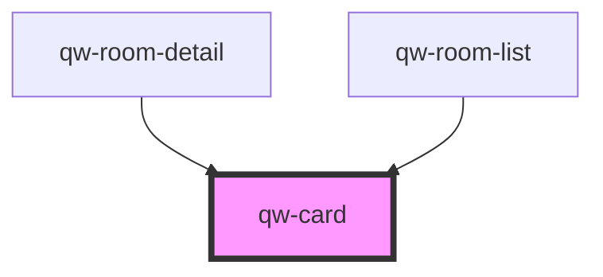

# qw-card

<!-- Auto Generated Below -->

## Properties

| Property    | Attribute    | Description | Type     | Default     |
| ----------- | ------------ | ----------- | -------- | ----------- |
| `cardTitle` | `card-title` |             | `string` | `undefined` |

## Dependencies

### Used by

 - [qw-room-detail](../../qw-room-detail)
 - [qw-room-list](../../qw-room-list)

### Graph

----------------------------------------------

*Built with [StencilJS](https://stenciljs.com/)*
