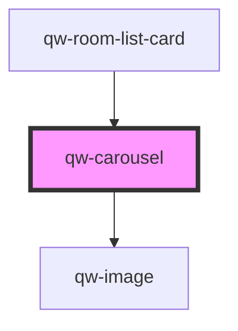

# qw-carousel

<!-- Auto Generated Below -->

## Properties

| Property                                   | Attribute | Description | Type                  | Default     |
| ------------------------------------------ | --------- | ----------- | --------------------- | ----------- |
| `qwCarouselImagesUrl`                      | --        |             | `RoomImageMetadata[]` | `undefined` |
| `qwRoomListCardImageTransformationOptions` | --        |             | `Options`             | `{}`        |

## Dependencies

### Used by

 - [qw-room-list-card](../../qw-room-list/qw-room-list-card)

### Depends on

- [qw-image](../qw-image)

### Graph

----------------------------------------------

*Built with [StencilJS](https://stenciljs.com/)*
