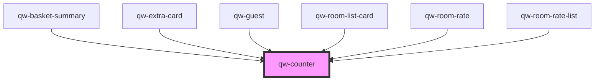

# qw-counter

<!-- Auto Generated Below -->

## Properties

| Property            | Attribute              | Description | Type               | Default     |
| ------------------- | ---------------------- | ----------- | ------------------ | ----------- |
| `qwCounterDisabled` | `qw-counter-disabled`  |             | `boolean`          | `undefined` |
| `qwCounterId`       | `qw-counter-id`        |             | `string`           | `undefined` |
| `qwCounterMaxValue` | `qw-counter-max-value` |             | `number`           | `undefined` |
| `qwCounterMinValue` | `qw-counter-min-value` |             | `number`           | `undefined` |
| `qwCounterName`     | `qw-counter-name`      |             | `number \| string` | `undefined` |
| `qwCounterValue`    | `qw-counter-value`     |             | `number`           | `0`         |

## Events

| Event                  | Description | Type                            |
| ---------------------- | ----------- | ------------------------------- |
| `qwCounterChangeValue` |             | `CustomEvent<QwCounterEmitter>` |

## Dependencies

### Used by

 - [qw-basket-summary](../../qw-basket-summary)
 - [qw-extra-card](../../qw-extra/qw-extra-card)
 - [qw-guest](../../qw-guest)
 - [qw-room-list-card](../../qw-room-list/qw-room-list-card)
 - [qw-room-rate](../../qw-room-rate)
 - [qw-room-rate-list](../../qw-room-rate-list)

### Graph

----------------------------------------------

*Built with [StencilJS](https://stenciljs.com/)*
